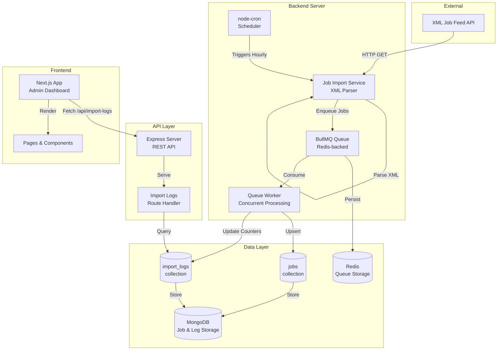
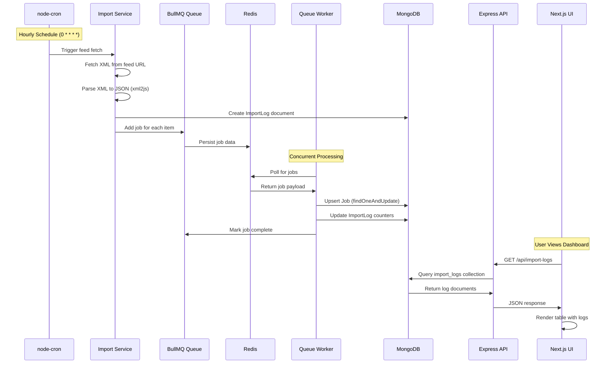
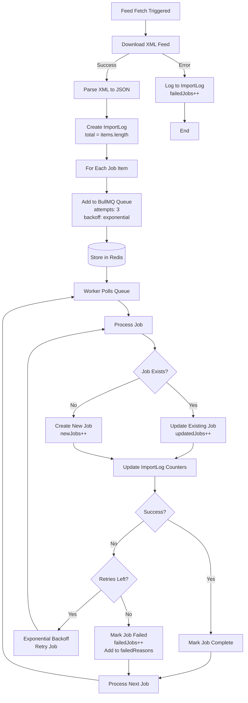
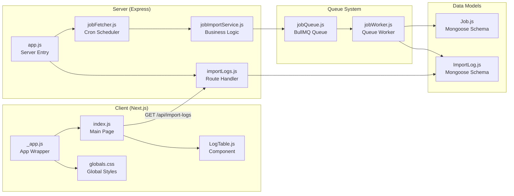
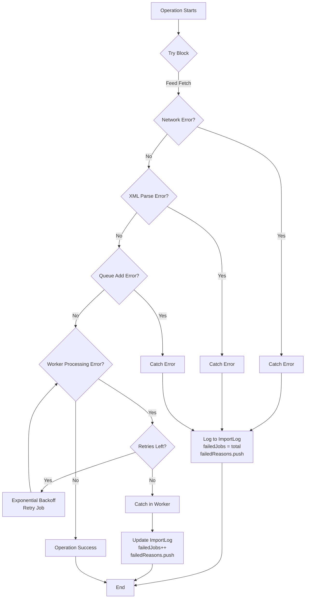
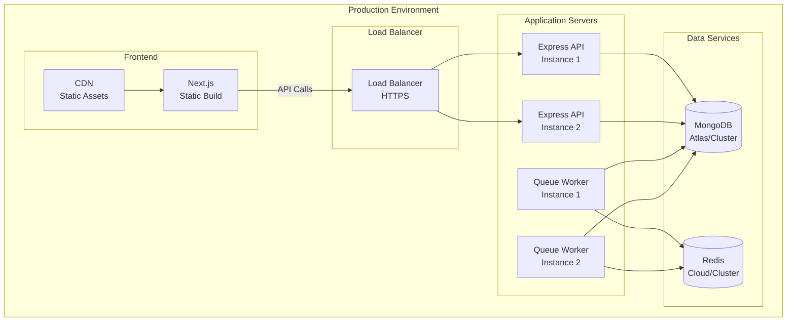

# Architecture Overview

## System Architecture Diagram

## Detailed Data Flow

## Queue Processing Workflow

## Component Interaction Diagram

## Error Handling Flow

## Deployment Architecture

---

## System Flow Summary

1. `node-cron` triggers an hourly import task.
2. The cron job downloads XML feeds, converts them to JSON, and enqueues each job payload.
3. BullMQ persists jobs in Redis, handles retries/backoff, and fans out work to concurrent workers.
4. Workers upsert jobs into MongoDB and increment ImportLog documents for observability.
5. The Express API exposes `/api/import-logs`, which the Next.js UI consumes to render an audit table.

## Technology Choices

- **BullMQ + Redis:** Preferred for reliability, built-in retries, delayed jobs, and effortless horizontal scaling. Using Redis keeps operational overhead low compared to heavier brokers.
- **xml2js:** Simple, battle-tested XML-to-JS converter; perfect for mapping feed fields before persistence.
- **node-cron:** Lightweight scheduler that fits a single-process deployment. In production, the same code could be run inside a dedicated worker pod or replaced with an external orchestrator.
- **MongoDB + Mongoose:** Schemaless flexibility plus a convenient ODM for enforcing job/import log shapes. Upsert semantics (`findOneAndUpdate` with `{ upsert: true }`) prevent duplicates.
- **Next.js:** Provides SSR/SSG flexibility for the admin UI and easy environment variable exposure using `NEXT_PUBLIC_*` conventions.

## Error Handling & Observability

- Worker retries leverage BullMQ's `attempts` and `backoff` options. Failures bubble into the failed set and are appended to the `failedReasons` array on the relevant `ImportLog` document.
- Fetch-level errors (e.g., network issues) are caught inside the cron service and logged against the run, ensuring every scheduled execution has an audit trail.
- Structured logging (see `server/utils/logger.js`) keeps console output consistent and ready for redirection to tools like Datadog or CloudWatch.

## Scalability Considerations

- Increase `QUEUE_CONCURRENCY` or start multiple worker processes to scale write throughput.
- The queue and worker modules are decoupled, enabling separate deployment units (e.g., worker-only containers).
- Future enhancements could include WebSocket notifications for UI updates, sharded Mongo clusters, or partitioned queue streams for extremely large imports.

## Security & Configuration

- Secrets remain in `.env`; templates (`.env.example`, `server/.env.example`) list required keys without real credentials.
- Add authentication (JWT, API keys, or OAuth) around the Express routes before exposing externally.
- Enforce HTTPS between the UI and API when deploying to production.
